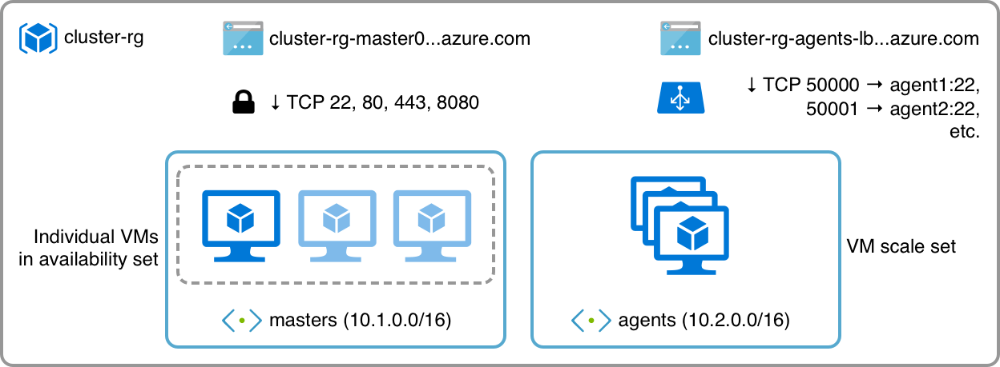

# azure-docker-swarm-cluster

## What

This is a barebones Azure Resource Manager template that automatically deploys a [Docker][d]-ready Ubuntu 16.04 cluster composed of 1-5 master VMs and a VM scaleset for workers/agents, plus the required network infrastructure:

 

## Why

This was built as [a barebones cluster template](http://taoofmac.com/space/blog/2016/08/07/2200) (for generic services that take advantage of dynamic scaling) and tweaked to show how to provision `cloud-init` scripts, VM scalesets and other ARM templating features.

Serendipitously, this was finished just in time to test barebones [Docker][d] Swarm 1.12 and demo it on an internal architecture session, and it was felt that it was in the general interest to make the template and support scripts publicly available.

## How

* `make params` - generates ARM template parameters and an SSH key for provisioning.
* `make deploy` - deploys cluster resources and pre-provisions Docker on all machines 
* `make check-deploy` - shortcut to check Azure deployment progress
* `make check-docker` - simple check to ensure [Docker][d] is running in all nodes
* `make provision-cluster` - provision the Swarm cluster (retrieve tokens and apply them to master and agent nodes)
* `make provision-service` - provision a simple HTTP service using [the `rcarmo/demo-frontend-stateless` Docker image][dh] (see the `test-service` folder for full source code)
* `make ips` - list allocated public iP addresses
* `make names` - list DNS aliases

## Requirements

* Python and supporting packages (`pip install -U -r requirements.txt`)
* The [Azure Cross-Platform CLI](https://github.com/Azure/azure-xplat-cli) (the new and to-my-eyes-improved [az][https://github.com/Azure/azure-cli] will also work, but the `Makefile` may require some tweaking)
* (Optional) `make` (you can just read through the `Makefile` and type the commands yourself)
* (Optional) `jq` (for parsing JSON data)
* (Optional) a local Docker installation to rebuild the bundled test service (see the aptly named `test-service` folder)

## Future Developments

A pure `bash` version will replace this in the fullness of time (the scripts used to provision the Swarm cluster were taken out of a [Python][p] application still under development to save time, and although exceedingly nice and demonstrative of a few techniques, they're not really necessary).

The template will also (eventually) be updated to include Azure portal monitoring stats (in order to use the template as a teaching aid that an unexperienced person could read through and understand in one sitting, a few common configurations were removed).

## Disclaimer

Keep in mind that the scripts were written for conciseness and ease of understanding -- you can use this as the basis for rolling out a production environment, but _only_ after adding some error-checking and common ARM template configurations like Azure portal monitoring.

Also keep in mind that the load-balancer configuration does _not_ include TCP port probing or proactive failure detection.

[d]: http://docker.com
[p]: http://python.org
[dh]:https://hub.docker.com/r/rcarmo/demo-frontend-stateless/